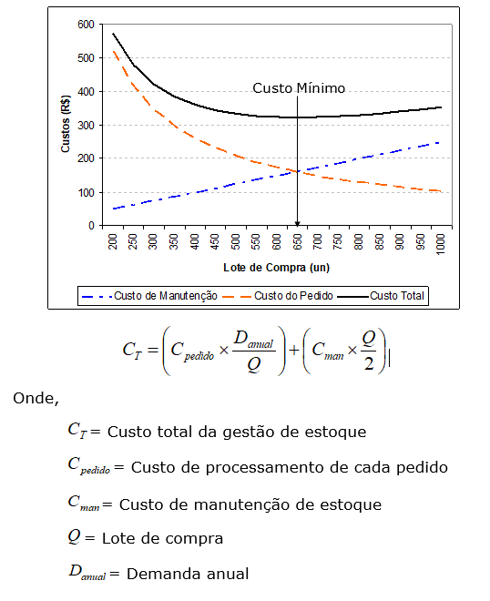
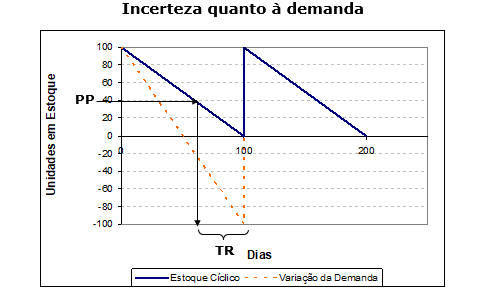
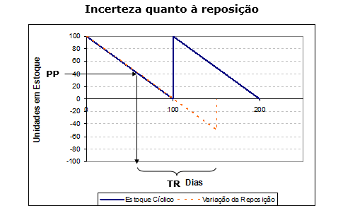
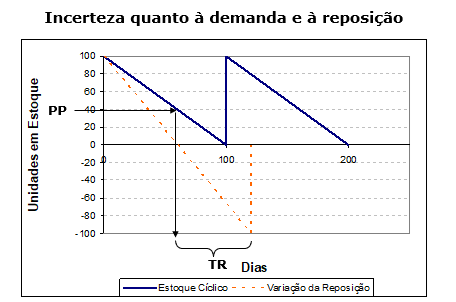
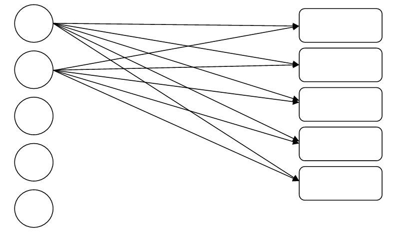
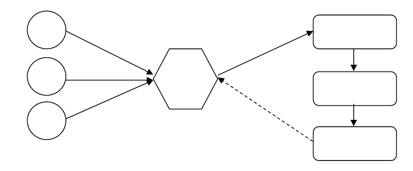
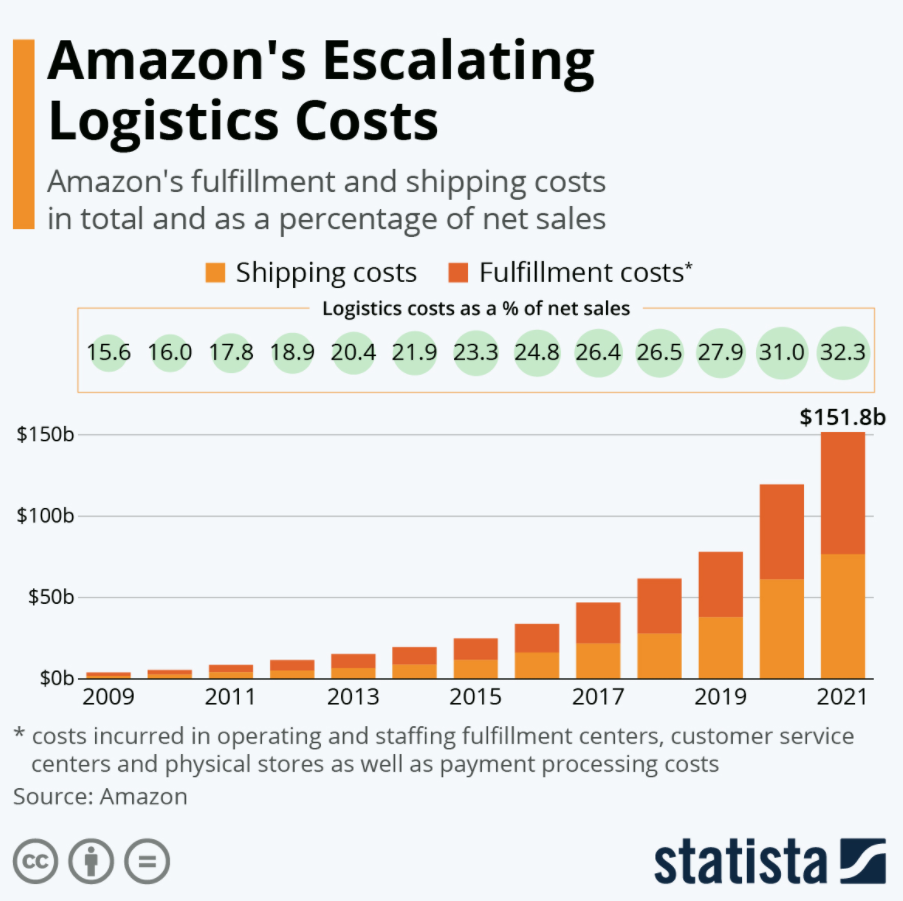

```{r child = "setup.Rmd"}
```

```{r xaringan-tile-view, echo=FALSE}
xaringanExtra::use_tile_view()
```

```{r xaringan-editable, echo=FALSE}
xaringanExtra::use_editable(expires = 1)
```

```{r xaringan-panelset, echo=FALSE, message=FALSE, warning=FALSE}
xaringanExtra::use_panelset()
xaringanExtra::style_panelset_tabs(panel_tab_font_family = "sans-serif")
```

```{r xaringanExtra-clipboard, echo=FALSE}
htmltools::tagList(
  xaringanExtra::use_clipboard(
    button_text = "<i class=\"fa fa-clipboard\"></i>",
    success_text = "<i class=\"fa fa-check\" style=\"color: #90BE6D\"></i>",
    error_text = "<i class=\"fa fa-times-circle\" style=\"color: #F94144\"></i>"
  ),
  rmarkdown::html_dependency_font_awesome()
)
```

```{r xaringan-fit-screen, echo=FALSE}
xaringanExtra::use_fit_screen()
```

```{r xaringan-extra-styles, echo=FALSE}
xaringanExtra::use_extra_styles(
  hover_code_line = TRUE,         #<<
  mute_unhighlighted_code = TRUE  #<<
)
```

```{r xaringan-scribble, echo=FALSE}
xaringanExtra::use_scribble()
```

class: center, middle

## Retrospecto

---

## Definições

### Logística

.midi[
.question[
“**Logística** é dispor a **mercadoria ou o serviço** certo, no **lugar** certo, no **tempo** certo e nas **condições desejadas**, ao mesmo tempo em que fornece a **maior contribuição à empresa**”. 
(Ballou, 2001)
]
]

### Gestão Cadeia de Suprimentos

.question[
.midi[
**Cadeia de suprimentos** é a estrutura consolidada e integrada, em níveis estratégico, tático e operacional, entre agentes de produção, mercadológicos, logísticos e sociedade, para que seja possível coordenar as operações de maneira a garantir a gestão orientada à logística, tendo como objetivo o _trade-off_ entre **responsividade** e **eficiência**, além de garantia de um contexto sustentável de desenvolvimento por ações **socialmente responsáveis** e **resilientes.** 
]
]

---

## Gestão Cadeia de Suprimentos

### Fatores-chave

- **Instalações**   
- **Estoques**   
- **Transportes**   
- **Informação**   
- **Precificação**
- **Sourcing**


---
## Gestão de Estoques

### Definições

Estoques são materiais ou produtos que ficam fisicamente disponíveis pela empresa, até o momento de ingressarem no processo produtivo ou seguirem para a comercialização direta ao consumidor final.

https://blog.portaleducacao.com.br/estoque-definicao-e-conceito/

---
## Gestão de Estoques

### Definições

Dentro de uma empresa, o estoque é representado por produtos (sejam eles produtos finais ou inacabados) que estão em posse de um agente econômico. São os materiais e suprimentos utilizados para a produção de seu produto ou para suprimir a necessidade da própria empresa.

https://blog.contaazul.com/glossario/estoque/

---

## Gestão de Estoques

### Definições

Estoque é a composição de materiais (matérias-primas, materiais em processamento, materiais semiacabados, materiais acabados, produtos acabados), que em determinado momento não é utilizado na empresa mas que será utilizado futuramente. Desta forma, o conceito de estoque inclui toda a variedade de materiais que empresa possui e utiliza no processo de produção de seus produtos e/ou serviços. Chiavenato (2005)

---
## Gestão de Estoques

### Definições

“Estoque é definido como a acumulação armazenada de recursos materiais em um sistema de transformação, ou também pode ser usado para descrever qualquer recurso armazenado” Slack, Chambers e Johnston (2009)


---
## Gestão de Estoques

### Tipos de estoque
- Matéria Prima
- Produtos em processamento
- Produtos acabados
- Estoque em trânsito
- Materiais de embalagem
- Estoque de componentes

---
## Gestão de Estoques

### Decisões

- Quanto pedir   
  - Custos de estoques   
  - Lote econômico de compras   

- Quando pedir   
  - Revisões contínuas e periódicas

- Estrutura e operacionalização de armazenagem

---
## Gestão de Estoques

### Objetivos

- economia financeira e maior produtividade;
- otimização do tempo, pois simplifica o processo de compras;
- evita a ruptura de estoque e gera segurança operacional;
- você conseguirá fazer uma boa negociação com os fornecedores.

---
## Gestão de Estoques

### Como realizar a gestão?
- Cálculo do nível de estoque cíclico
- Cálculo do nível de estoque de segurança
- Determinação de Lote Econômico de Compra
- Atualização de inventário
- Replanejamento do suprimento
- Determinação do ponto de pedido
- Recebimento e armazenagem de materiais
- Conservar material em condições adequadas
- Entregar material mediante requisição
- Documentação
- Organização do almoxarifado

---

## Gestão de Estoques

### Lote Econômico de Compras

Trade-off entre custos de manutenção de estoque e custos de reposição (transporte)

```{r echo=FALSE, message=FALSE, warning=FALSE}

```


---
## Gestão de Estoques

### Lote Econômico de Compras
```{r echo=FALSE, message=FALSE, warning=FALSE}
knitr::include_graphics("img/2022-06-01 17_28_48-.png")
```

---
## Gestão de Estoques

### Lote Econômico de Compras

Considere a demanda média semanal de 100 unidades por um determinado produto. O custo de compra de cada item é R$ 2,00 por unidade. O custo de manutenção equivale a 25% do custo de compra de cada item e o custo para processamento de cada pedido é R$ 20,00. Determine o lote econômico de compras. 

---

## Gestão de Estoques

### Estoque de segurança
```{r echo=FALSE, message=FALSE, warning=FALSE}

```

---
## Gestão de Estoques

### Estoque de segurança
```{r echo=FALSE, message=FALSE, warning=FALSE}

```

---
## Gestão de Estoques

### Estoque de segurança
```{r echo=FALSE, message=FALSE, warning=FALSE}

```

---
## Gestão de Estoques

### Estoque de segurança
```{r echo=FALSE, message=FALSE, warning=FALSE}
knitr::include_graphics("img/2022-06-01 17_29_47- - Copia.png")
```


---
## Gestão de Estoques

### Estoque de segurança

O nível do Estoque de Segurança é determinado pela variabilidade da demanda e da reposição. Caso sejam distribuídas segundo a distribuição normal no entorno dos valores médios, utiliza-se o conceito de desvio padrão para cálculo do nível do estoque de segurança, considerando-se a probabilidade de não atendimento (nível de serviço).

---
## Gestão de Estoques

### Como controlar o sistema   
  - Curva ABC   
  - Inventário   
  - Planejamento de estoques de segurança   
  - Simulação de demanda e reposição
  
---
class: inverse, middle

# Redes Logísticas

---

## FATORES QUE INFLUENCIAM AS DECISÕES DE REDE

.pull-left[
### Sob a ótica do transportador
- Custo relacionado ao veículo
- Custo operacional fixo
- Custo relacionado à viagem
- Custo relacionado à quantidade
- Custo indireto
]

.pull-right[
### Sob a ótica do embarcador
- Custo de transporte
- Custo de estoque
- Custo de instalação
- Custo de processamento
- Custo do nível de serviço
]

.tip[
O projeto da rede logística é fator decisivo para garantir responsividade e eficiência na cadeia de suprimentos. 
]
---

# Tipos de redes logísticas

## Rede de entrega direta
.question[
Todas as entregas acontecem diretamente do fornecedor para o varejista. Neste caso, a rota de cada carregamento é pré-determinada, sendo necessário definir apenas o volume a ser transportado e o meio de transporte mais eficiente. 
]

---

# Tipos de redes logísticas

## Rede de entrega direta

.pull-left[
.midi[
**Vantagens:**
- eliminação de intermediários logísticos, como atacadistas ou centros de distribuição;   
- simplicidade de operação e coordenação;   
- decisão sobre embarque é local;   
- baixa interferência entre fluxos;   
- tempo de transporte do fornecedor até ao ponto de varejo é reduzido.   

]]

.pull-right[
.midi[
**Desvantagens:**
- no caso de lojas pequenas, a rede de entrega direta é onerosa;   
- geraria um elevado custo de estoque na cadeia de suprimentos;   
- os custos de recebimento são altos porque cada fornecedor deve fazer uma entrega separada.    
]]

.tip[
.midi[
São aconselháveis quando o tamanho das lojas varejistas for suficientemente grande para justificar lotes de suprimentos ótimos próximos à carga cheia proveniente de cada fornecedor. 
]]

---

# Tipos de redes logísticas

## Rede de entrega direta

```{r echo=FALSE, message=FALSE, warning=FALSE}

```


---

# Tipos de redes logísticas

## Entrega direta com milk run (coletas programadas)

.question[
Milk Run é um tipo de transporte para entrega e coleta de produtos em que um caminhão pode tanto entregar ou coletar um produto partindo de um único fornecedor para diversos varejistas ou de diversos fornecedores para entregar para apenas um varejista, respectivamente.
]

**Vantagens:**
- Eliminação de depósitos intermediários
- Redução dos custos de transporte por consolida as entregas a diversas lojas em um único caminhão. 

---

# Tipos de redes logísticas

## Entrega direta com milk run (coletas programadas)

.pull-left[
```{r echo=FALSE, message=FALSE, warning=FALSE}
knitr::include_graphics("img/rede2.png")
```
]

.pull-right[
```{r echo=FALSE, message=FALSE, warning=FALSE}
knitr::include_graphics("img/rede3.png")
```

]


---

# Tipos de redes logísticas

## Todas as entregas via centro de distribuição centralizado

.question[
A cadeia varejista distribui as lojas por localização geográfica e um CD é designado para atendimento destas lojas. Os fornecedores enviam as entregas para o CD e de lá as mercadorias são encaminhadas para as lojas. 
]

.midi[
- O CD pode desempenhar dois papéis diferentes, a saber: (i) **armazenar estoque**; (ii) **local de transferência**. 

- Os CDs auxiliam na redução dos custos da cadeia de suprimentos quando os fornecedores estão longe dos varejistas e os custos de transporte são altos, por meio de economias de escala. 

- O CD pode fazer apenas crossdocking, quando os lotes destinados às lojas servidas pelos CDs forem grandes o suficiente para atingir economias de escalas obtidas no ressuprimento de entrada. 
]

---

# Tipos de redes logísticas

## Todas as entregas via centro de distribuição centralizado

.question[
Crosdocking é o processo no qual chegam caminhões de diversos fornecedores, cuja carga é desmembrada em caminhões para diversos varejistas em carregamentos menores. 
]


```{r echo=FALSE, message=FALSE, warning=FALSE}
knitr::include_graphics("img/rede4.png")
```


---

# Tipos de redes logísticas


##	Entregas via centro de distribuição utilizando milk run

.question[
As entregas são realizadas a partir de um CD utilizando-se milk run quando os lotes a serem entregues em cada varejista forem pequenos, visando reduzir os custos com transportes por meio da consolidação. 
]


```{r echo=FALSE, message=FALSE, warning=FALSE}

```


---

# Tipos de redes logísticas


##	Rede sob medida
.question[
O transporte mescla crosdocking, milk run, transportadoras truck load, less than truck load e carga expressa. 
]

---

## Vantagens e Desvantagens das diferentes redes de transporte

.small[
Estrutura de Rede	|Vantagens|	Desvantagens
----------------| ----------| -------------
Entrega direta|Não possui depósito intermediário <br/>	Fácil de coordenar	|Grandes estoques <br/>	Despesa significativa com recebimento
Entrega direta com milk runs|	Redução dos custos de transporte para lotes pequenos <br/>		Redução dos estoques	|	Coordenação mais complexa
Todas as entregas via CD com armazenagem|	Redução dos custos de entrada do transporte por meio de consolidação| Maior custo de estoque <br/>	Mais manuseio no CD
Todas entregas via CD com crossdocking|	Pouquíssima necessidade de estoques <br/>	Redução no custo de transporte devido à consolidação | Coordenação mais complexa
Entregas via CD com milk runs|	Redução no custo de saída do transporte para pequenos lotes	| Coordenação ainda mais complexa
Rede sob medida	| Escolha do transporte mais adequado às necessidades individuais do produto ou da loja	| Coordenação muitíssimo complexa
]

---

# Exemplos de desenho de rede e seu impacto

```{r echo=FALSE, message=FALSE, warning=FALSE, out.width="50%"}

```
---

# Rede global e gargalos logísticos

[Link](https://www.smh.com.au/business/companies/omicron-supply-chain-troubles-set-scene-for-volatile-retail-results-20220206-p59u5p.html)

“Retailers with high-volume, low-margin products have had to spend a lot more to ensure that their supply chains can cope with all the disruption and chaos that’s gone on with lockdowns and with rising cases more recently,” he said.

---
# Rede global e gargalos logísticos


[Link](https://www.moneytimes.com.br/varejistas-alemaes-relatam-menos-gargalos-de-fornecimento-em-janeiro-diz-ifo/)

"Os gargalos de oferta que têm atormentado os varejistas na Alemanha diminuíram significativamente em janeiro, mostrou uma pesquisa do instituto Ifo, com 57,1% das lojas dizendo que não conseguiram entregar todos os produtos encomendados, abaixo dos 81,6% em dezembro"

---
# Rede global e gargalos logísticos

"Os fabricantes viram seus estoques de semicondutores despencarem em meio à escassez global de chips, alertou o Departamento de Comércio dos EUA. Uma pesquisa com mais de 150 empresas descobriu que os suprimentos caíram de uma média de 40 dias em 2019 para apenas cinco dias no final de 2021."

"Com a demanda em alta e a plena utilização das instalações de fabricação existentes, está claro que a única solução para resolver essa crise a longo prazo é reconstruir nossas capacidades de fabricação domésticas." disse a secretária de comércio dos EUA, Gina Raimondo, em um comunicado. A pesquisa também descobriu que a demanda por semicondutores foi 17% maior no ano passado do que em 2019.

Na terça, 25/1, os democratas da Câmara dos EUA divulgaram a proposta legislativa que prevê aportes de US$ 52 bilhões em **produção e pesquisa de semicondutores**. [Link]

[Link]: [Link](https://www.convergenciadigital.com.br/Negocios/Crise-de-semicondutores-faz-estoques-de-chips-despencaram-de-40-para-5-dias-59250.html?UserActiveTemplate=mobile)

---
# Revisão da distribuição de pontos - EPC

Pontos|	Atividade
------|------------
10|  Estudos Autônomos 1 - Nivel de serviço logístico
10|  Estudos Autônomos 2 - TICs e KPIs
10|  Estudos Autônomos 3 – Logística Urbana
10|  Estudos Autônomos 4 - Gestão de Transportes
10|  Estudos Autônomos 5 - Redes Logísticas
10|  Estudos Autônomos 6 - Custos logísticos
10|  Projeto integrador 1
10|  Projeto integrador 2
10|  Projeto integrador 3
10|  Projeto integrador 4
TOTAL:| 	100 pontos

---

# Revisão da distribuição de pontos - ADM

Pontos|	Atividade
------|------------
10|  Estudos Autônomos 1 - Nivel de serviço logístico
10|  Estudos Autônomos 2 - TICs e KPIs
10|  Estudos Autônomos 3 – Logística Urbana
10|  Estudos Autônomos 4 - Gestão de Transportes
10|  Estudos Autônomos 5 - Gestão de estoques e armazenagem
05|  Estudos Autônomos 6 - Redes Logísticas
10|  Estudos Autônomos 7 - Custos logísticos
05|  Projeto integrador 1
10|  Projeto integrador 2
10|  Projeto integrador 3
10|  Projeto integrador 4
TOTAL:| 	100 pontos

---

class: center, middle

.larger[
**DÚVIDAS?**
]
